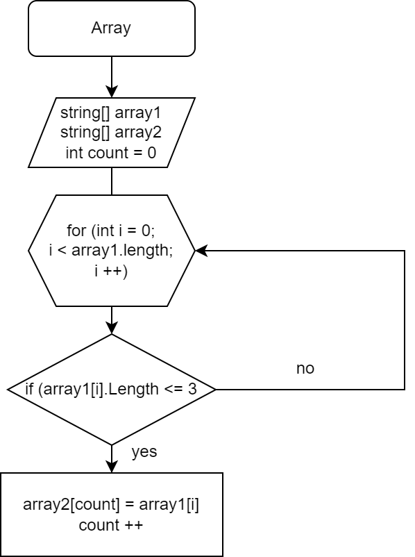

*Задача:* Написать программу, которая из имеющегося массива строк формирует новый массив из строк, длина которых меньше, либо равна 3 символам. Первоначальный массив можно ввести с клавиатуры, либо задать на старте выполнения алгоритма. При решении не рекомендуется пользоваться коллекциями, лучше обойтись исключительно массивами.
*Описание решения задачи:* Сначала объявляется два массива одинаковой длины. Потом метод, в котором цикл соответствует длине массива, внутри цикла производится проверка условия **( <=3 )**, если да элемент первого массива заносится в **count** элемент второго массива. Переменная count создана, чтобы данные из первого массива поочередно передавать во второй массив. После присвоения переменная count увеливается на 1 и возвращается к циклу **for** в котором **i** увеличивается на 1. Таким образом производится проверка до конца.
